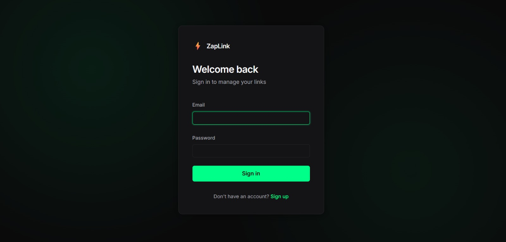
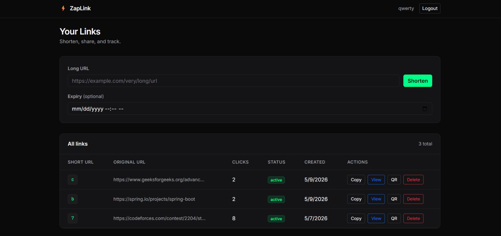
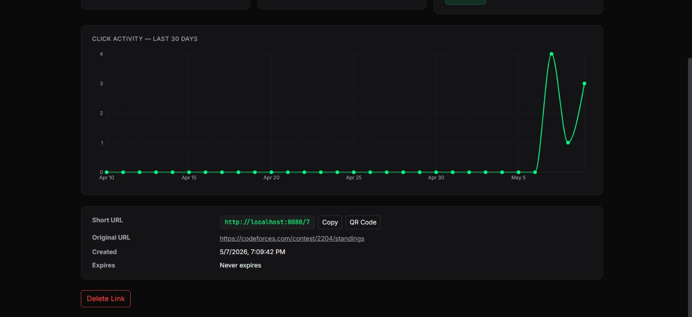
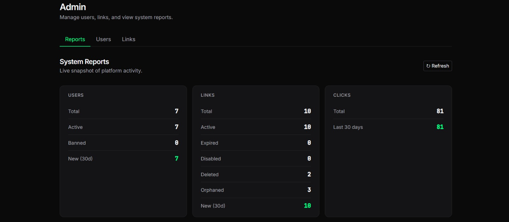
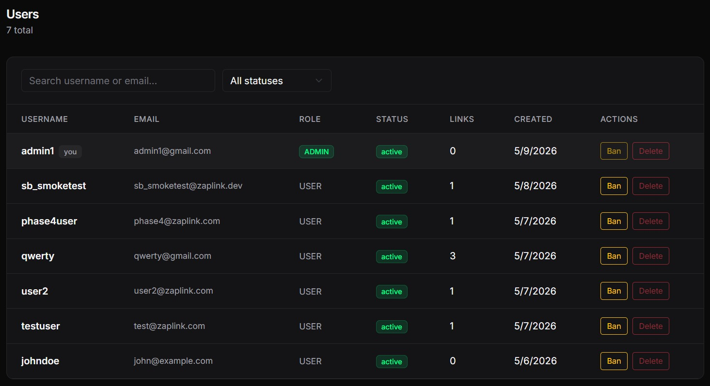
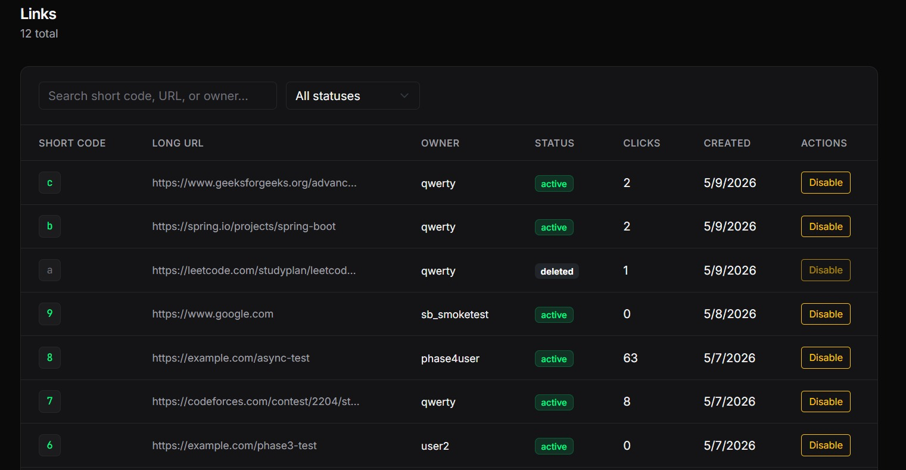

# ⚡ ZapLink

> A full-stack URL shortening service with analytics and QR code support.
> Built with Spring Boot, React, and MySQL.

---

## 📑 Table of Contents

- [About](#-about)
- [Quick Start](#-quick-start)
- [Features](#-features)
- [Tech Stack](#-tech-stack)
- [Architecture](#-architecture)
- [Prerequisites](#-prerequisites)
- [Installation & Setup](#-installation--setup)
- [Environment Variables](#-environment-variables)
- [Database Schema](#-database-schema)
- [API Endpoints](#-api-endpoints)
- [Folder Structure](#-folder-structure)
- [Usage](#-usage)
- [Screenshots](#-screenshots)
- [Deployment](#-deployment)
- [Roadmap](#-roadmap)

---

## 📖 About

ZapLink is a full-stack URL shortening service that lets users convert long, unwieldy URLs into short, shareable links. Beyond simple shortening, ZapLink provides click analytics, QR code generation, and link expiration controls, giving users full visibility and control over their shared links.

The application also exposes a public REST API, making it easy for developers to integrate URL shortening into their own tools and workflows. Built with Spring Boot, React, and MySQL, ZapLink is designed to be lightweight, fast, and free for everyone.

This project was built as a learning and portfolio piece to explore full-stack development with Spring Boot, React, and MySQL — while creating a genuinely useful tool.

### 🌟 Highlights

- **Sub-100ms redirects** via async click logging with Spring events
- **Stateless JWT auth** with role-based access control (USER / ADMIN)
- **Per-user dedup** that respects soft-delete history
- **Cascade-aware admin moderation** — banning a user disables their links, unbanning restores them, and admin-disabled links are protected from the cascade
- **30-day click analytics** with zero-fill for a contiguous timeline
- **Interactive API docs** at `/swagger-ui.html` once the backend is running

---

## ⚡ Quick Start

**Try the live demo:** [link TBD]

**Or explore the API:** [Swagger UI link TBD]

**Run locally:** see [Installation & Setup](#-installation--setup) below.

---

## ✨ Features

> **Status:** All features below are implemented and live. See the deployed demo (link above) or run locally with the instructions in this README.

### 🔗 Core
- Shorten long URLs into short, shareable links
- Redirect short URLs to their original destination
- Set expiration dates for links (auto-invalidate after expiry)

### 👤 User Accounts
- User registration and login (authentication)
- Personal dashboard to view and manage your links
- Delete your own short links anytime

### 📊 Analytics
- Track total click count per short link
- View click timestamps and visualize activity over time with graphs

### 🛡️ Security & Validation
- Validate URL format before shortening
- Block malicious and phishing URLs using a blacklist / safe-browsing check
- Rate limiting on shortening requests to prevent abuse and spam

### 🚀 Extras
- Generate a QR code for any short link
- Public REST API for programmatic URL shortening

### 🛠️ Admin
- Admin dashboard to view all users and all links
- Disable or remove abusive / reported links
- User management — ban or delete users
- System-wide analytics and reports (total links, clicks, active users, trends)

---

## 🛠️ Tech Stack

**Frontend**
- React 18 (with Vite)
- Bootstrap 5 with a custom dark theme (CSS-variable overrides)
- Recharts (analytics visualization)
- Inter + JetBrains Mono fonts via Google Fonts
- Axios with JWT interceptor
- React Router

**Backend**
- Java 17+
- Spring Boot
- Spring Web (REST APIs)
- Spring Security (authentication & authorization)
- Spring Data JPA (ORM)
- Maven (build tool)

**Database**
- MySQL 8+

**Authentication**
- JWT (JSON Web Tokens) for stateless authentication

**Other Tools & Libraries**
- ZXing — QR code generation
- Bucket4j — in-memory rate limiting
- Google Safe Browsing API — malicious / phishing URL detection
- springdoc-openapi — interactive Swagger UI at `/swagger-ui.html`
- Lombok — reduce boilerplate (getters, setters, constructors)

---

## 🏗️ Architecture

ZapLink follows a classic 3-tier architecture:

```
┌─────────────┐      HTTP/REST       ┌──────────────┐      JDBC      ┌─────────┐
│   React     │  ───────────────►    │ Spring Boot  │  ───────────►  │  MySQL  │
│  Frontend   │  ◄───────────────    │   Backend    │  ◄───────────  │   DB    │
└─────────────┘      JSON            └──────────────┘                └─────────┘
```

- **Frontend (React)** — UI for shortening URLs, dashboard, analytics, QR code display
- **Backend (Spring Boot)** — REST APIs, auth, business logic, rate limiting, URL validation, QR generation
- **Database (MySQL)** — stores users, links, click events

### 🔄 Example Flows

#### 1. Shortening a URL
1. User submits a long URL via the React frontend
2. Request is sent to Spring Boot REST API with JWT in the header
3. Backend validates the URL format and checks against the safe-browsing blacklist
4. Bucket4j enforces rate limiting per user
5. A unique short code is generated (Base62 of an auto-increment ID)
6. The link is saved in MySQL and the short URL is returned to the frontend

#### 2. Redirecting a Short URL
1. User visits `https://zaplink.com/{shortCode}`
2. Backend looks up the short code in MySQL
3. If found and not expired:
   - A click event is published asynchronously (Spring events — redirect is not delayed)
   - Redirects (HTTP 302) to the original long URL
4. If expired, disabled, or not found, returns a custom HTML error page

#### 3. QR Code Generation
1. User clicks "QR" for a short link on their dashboard
2. Frontend sends a GET request to the QR endpoint with the link ID
3. Backend uses ZXing to generate a 300×300 PNG QR code encoding the short URL
4. QR code is returned as raw PNG bytes and displayed in a modal
5. User can preview or download the QR code

#### 4. Viewing Analytics
1. User opens a link's detail page
2. Frontend requests click data for the link
3. Backend queries MySQL for click counts — aggregated by day, zero-filled to 30 entries
4. Aggregated data is returned and rendered as a line chart via Recharts

---

## 📦 Prerequisites

Make sure the following are installed on your system before setting up ZapLink:

### Required
- **Java 17** (LTS) — [Download](https://adoptium.net/)
- **Maven 3.8+** — [Download](https://maven.apache.org/download.cgi)
- **Node.js 18+ and npm** — [Download](https://nodejs.org/)
- **MySQL 8+** — [Download](https://dev.mysql.com/downloads/)
- **Git** — [Download](https://git-scm.com/)

### Optional (recommended)
- **IntelliJ IDEA** — [Download](https://www.jetbrains.com/idea/download/) or **Eclipse** — [Download](https://www.eclipse.org/downloads/) for backend development
- **VS Code** — [Download](https://code.visualstudio.com/) for frontend development
- **Postman** — [Download](https://www.postman.com/downloads/) or **Insomnia** — [Download](https://insomnia.rest/download) for testing the REST API
- **MySQL Workbench** — [Download](https://dev.mysql.com/downloads/workbench/) for database management

---

## ⚙️ Installation & Setup

ZapLink is organized as a monorepo with two folders: `backend/` (Spring Boot) and `frontend/` (React).

### 1. Clone the Repository
```bash
git clone https://github.com/ParthDawande/zaplink.git
cd zaplink
```

### 2. Database Setup
Open MySQL and create the database:
```sql
CREATE DATABASE zaplink;
```

Then run the provided schema script to create the required tables:
```bash
mysql -u root -p zaplink < backend/src/main/resources/schema.sql
```

### 3. Backend Setup
```bash
cd backend
```

Configure your database credentials in `src/main/resources/application.properties` (see the [Environment Variables](#-environment-variables) section below).

Build and run:
```bash
mvn clean install
mvn spring-boot:run
```
The backend will start on **http://localhost:8080**.  
Interactive API docs are available at **http://localhost:8080/swagger-ui.html**.

### 4. Frontend Setup
Open a new terminal:
```bash
cd frontend
npm install
npm run dev
```
The frontend will start on **http://localhost:5173**.

### 5. Access the Application
Open your browser and go to **http://localhost:5173** to start using ZapLink.

---

## 🔐 Environment Variables

ZapLink requires configuration for both the backend and frontend. **Never commit real credentials or API keys to version control.** Use the `.env.example` files as templates.

### Backend (`backend/src/main/resources/application.properties`)

```properties
# === Server ===
server.port=8080

# === Database ===
spring.datasource.url=jdbc:mysql://localhost:3306/zaplink
spring.datasource.username=<your_mysql_username>
spring.datasource.password=<your_mysql_password>
spring.datasource.driver-class-name=com.mysql.cj.jdbc.Driver

# === JPA / Hibernate ===
spring.jpa.hibernate.ddl-auto=none
spring.jpa.show-sql=true
spring.jpa.database-platform=org.hibernate.dialect.MySQLDialect

# === JWT ===
jwt.secret=<your_jwt_secret_key_at_least_32_characters>
jwt.expiration-ms=86400000

# === Rate Limiting (Bucket4j — per-user / per-IP) ===
ratelimit.create-link.capacity=30
ratelimit.create-link.refill-period-seconds=60
ratelimit.register.capacity=5
ratelimit.register.refill-period-seconds=60
ratelimit.login.capacity=10
ratelimit.login.refill-period-seconds=60
ratelimit.default.capacity=120
ratelimit.default.refill-period-seconds=60

# === Google Safe Browsing ===
safebrowsing.api-key=<your_google_safe_browsing_api_key>
safebrowsing.timeout-ms=2000
safebrowsing.enabled=true

# === Application ===
zaplink.base-url=http://localhost:8080
zaplink.frontend-url=http://localhost:5173
```

### Frontend (`frontend/.env`)

```
VITE_API_BASE_URL=http://localhost:8080
```

### `.env.example` Template Files

The repository includes example template files with placeholder values:
- `backend/src/main/resources/application.properties.example`
- `frontend/.env.example`

Copy these to their actual filenames and fill in your own values:

```bash
# macOS / Linux
cp backend/src/main/resources/application.properties.example backend/src/main/resources/application.properties
cp frontend/.env.example frontend/.env

# Windows
copy backend\src\main\resources\application.properties.example backend\src\main\resources\application.properties
copy frontend\.env.example frontend\.env
```

> ⚠️ **Important:** Add `application.properties` and `.env` to your `.gitignore` to prevent committing secrets.

---

## 🗄️ Database Schema

ZapLink uses a MySQL database with three main tables: `users`, `links`, and `clicks`.

### `users`
Stores registered user accounts.

| Column          | Type                        | Constraints                          | Description                          |
|-----------------|-----------------------------|--------------------------------------|--------------------------------------|
| `id`            | BIGINT                      | PRIMARY KEY, AUTO_INCREMENT          | Unique user ID                       |
| `username`      | VARCHAR(50)                 | UNIQUE, NOT NULL                     | User's chosen username               |
| `email`         | VARCHAR(100)                | UNIQUE, NOT NULL                     | User's email address                 |
| `password_hash` | VARCHAR(255)                | NOT NULL                             | Hashed password (BCrypt)             |
| `role`          | ENUM('USER', 'ADMIN')       | NOT NULL, DEFAULT 'USER'             | Role for authorization               |
| `is_active`     | BOOLEAN                     | NOT NULL, DEFAULT TRUE               | Used to ban / disable users          |
| `created_at`    | TIMESTAMP                   | NOT NULL, DEFAULT CURRENT_TIMESTAMP  | Account creation time                |

### `links`
Stores shortened URLs created by users.

| Column           | Type                                    | Constraints                                  | Description                                      |
|------------------|-----------------------------------------|----------------------------------------------|--------------------------------------------------|
| `id`             | BIGINT                                  | PRIMARY KEY, AUTO_INCREMENT                  | Unique link ID (used to derive `short_code`)     |
| `short_code`     | VARCHAR(10)                             | UNIQUE, NULL during creation window          | Base62-encoded short identifier                  |
| `long_url`       | TEXT                                    | NOT NULL                                     | The original long URL                            |
| `user_id`        | BIGINT                                  | FK → `users(id)` ON DELETE SET NULL          | Owner of the link (NULL if user was deleted)     |
| `expires_at`     | TIMESTAMP                               | NULL                                         | Optional expiration date                         |
| `is_active`      | BOOLEAN                                 | NOT NULL, DEFAULT TRUE                       | FALSE if disabled by admin or user ban           |
| `disabled_reason`| ENUM('USER_BANNED', 'ADMIN_DISABLED')   | NULL                                         | Why the link was disabled                        |
| `deleted_at`     | TIMESTAMP                               | NULL                                         | Soft-delete timestamp (NULL = not deleted)       |
| `created_at`     | TIMESTAMP                               | NOT NULL, DEFAULT CURRENT_TIMESTAMP          | Link creation time                               |

### `clicks`
Stores individual click events for analytics.

| Column        | Type       | Constraints                              | Description                          |
|---------------|------------|------------------------------------------|--------------------------------------|
| `id`          | BIGINT     | PRIMARY KEY, AUTO_INCREMENT              | Unique click ID                      |
| `link_id`     | BIGINT     | NOT NULL, FOREIGN KEY → `links(id)`      | The link that was clicked            |
| `clicked_at`  | TIMESTAMP  | NOT NULL, DEFAULT CURRENT_TIMESTAMP      | Time of the click                    |

### Relationships
- **One user → many links** (`users.id` → `links.user_id`, ON DELETE SET NULL)
- **One link → many clicks** (`links.id` → `clicks.link_id`, ON DELETE CASCADE)

> 📄 The full schema with indexes is available in `backend/src/main/resources/schema.sql`.

---

## 🔌 API Endpoints

ZapLink exposes a REST API for all functionality. All `/api/*` endpoints (except `/api/auth/*`) require a JWT token in the `Authorization` header. The redirect endpoint (`/{shortCode}`) is public.

> 📘 **Live API Docs:** Once the backend is running, full interactive Swagger UI is available at
> **http://localhost:8080/swagger-ui.html**

### 🔐 Authentication

| Method | Endpoint              | Auth   | Description                          |
|--------|-----------------------|--------|--------------------------------------|
| POST   | `/api/auth/register`  | Public | Register a new user                  |
| POST   | `/api/auth/login`     | Public | Log in and receive a JWT token       |
| GET    | `/api/me`             | Required | Get the current authenticated user  |

### 🔗 Links

| Method | Endpoint                  | Auth     | Description                                      |
|--------|---------------------------|----------|--------------------------------------------------|
| POST   | `/api/links`              | Required | Create a new short link                          |
| GET    | `/api/links`              | Required | List all links owned by the current user         |
| GET    | `/api/links/{id}`         | Required | Get details of a specific link                   |
| DELETE | `/api/links/{id}`         | Required | Delete a link owned by the current user          |
| GET    | `/api/links/{id}/qr`      | Required | Get the QR code (PNG) for a short link           |
| GET    | `/{shortCode}`            | Public   | Redirect to the original long URL                |

### 📊 Analytics

| Method | Endpoint                          | Auth     | Description                                            |
|--------|-----------------------------------|----------|--------------------------------------------------------|
| GET    | `/api/links/{id}/analytics`       | Required | Get total clicks + 30-day breakdown for a single link  |

### 🛠️ Admin

| Method | Endpoint                            | Auth         | Description                              |
|--------|-------------------------------------|--------------|------------------------------------------|
| GET    | `/api/admin/users`                  | ADMIN only   | List all users                           |
| PATCH  | `/api/admin/users/{id}/ban`         | ADMIN only   | Ban or unban a user                      |
| DELETE | `/api/admin/users/{id}`             | ADMIN only   | Delete a user                            |
| GET    | `/api/admin/links`                  | ADMIN only   | List all links in the system             |
| PATCH  | `/api/admin/links/{id}/disable`     | ADMIN only   | Disable or re-enable a link              |
| GET    | `/api/admin/reports`                | ADMIN only   | System-wide analytics & reports          |

### 📦 Example Requests & Responses

#### 🔐 Register
```http
POST /api/auth/register
Content-Type: application/json

{
  "username": "johndoe",
  "email": "john@example.com",
  "password": "securePass123"
}
```
**Response (201 Created)**
```json
{
  "id": 1,
  "username": "johndoe",
  "email": "john@example.com",
  "role": "USER"
}
```

#### 🔐 Login
```http
POST /api/auth/login
Content-Type: application/json

{
  "email": "john@example.com",
  "password": "securePass123"
}
```
**Response (200 OK)**
```json
{
  "token": "eyJhbGciOiJIUzI1NiIsInR5cCI6...",
  "expiresIn": 86400000
}
```

#### 🔗 Create Short Link
```http
POST /api/links
Authorization: Bearer <your_jwt_token>
Content-Type: application/json

{
  "longUrl": "https://example.com/some/very/long/article-url",
  "expiresAt": "2025-12-31T23:59:59"
}
```
**Response (201 Created)**
```json
{
  "id": 42,
  "shortCode": "abc123",
  "shortUrl": "http://localhost:8080/abc123",
  "longUrl": "https://example.com/some/very/long/article-url",
  "expiresAt": "2025-12-31T23:59:59",
  "createdAt": "2025-05-03T10:15:30"
}
```

#### 📊 Get Link Analytics
```http
GET /api/links/42/analytics
Authorization: Bearer <your_jwt_token>
```
**Response (200 OK)**
```json
{
  "linkId": 42,
  "shortCode": "abc123",
  "totalClicks": 137,
  "last30DaysClicks": 52,
  "dailyClicks": [
    { "date": "2025-04-03", "count": 0 },
    { "date": "2025-04-04", "count": 3 },
    "..."
  ]
}
```

#### 🔗 Redirect (Public)
```http
GET /abc123
```
**Response:** `302 Found` → redirects to the original long URL.

### ⚠️ Error Responses

All errors follow a consistent JSON structure:
```json
{
  "timestamp": "2025-05-03T10:15:30",
  "status": 400,
  "error": "Bad Request",
  "message": "Invalid URL format",
  "path": "/api/links"
}
```

Common HTTP status codes:
- `400` — Validation error (bad URL, missing fields)
- `401` — Missing or invalid JWT token
- `403` — Forbidden (e.g., non-admin hitting admin endpoint)
- `404` — Link / user not found
- `409` — Conflict (e.g., username already taken)
- `429` — Too many requests (rate limit exceeded)

> Note: The redirect endpoint (`GET /{shortCode}`) returns an HTML error page on failure, not JSON.

---

## 📁 Folder Structure

ZapLink is organized as a monorepo with two top-level folders: `backend/` (Spring Boot) and `frontend/` (React).

```
zaplink/
├── backend/                              # Spring Boot application
│   ├── src/
│   │   ├── main/
│   │   │   ├── java/com/zaplink/
│   │   │   │   ├── controller/           # REST endpoint handlers
│   │   │   │   ├── service/              # Business logic (URL shortening, analytics, etc.)
│   │   │   │   ├── repository/           # JPA repositories (database access)
│   │   │   │   ├── model/                # JPA entities (User, Link, Click)
│   │   │   │   ├── dto/                  # Request / response DTOs
│   │   │   │   ├── config/               # App configuration (CORS, OpenAPI, async)
│   │   │   │   ├── security/             # JWT filter, rate limiter, auth entry point
│   │   │   │   ├── exception/            # Custom exceptions & global error handler
│   │   │   │   ├── event/                # Async click recording (Spring events)
│   │   │   │   ├── util/                 # Base62 encoder, QR generator, reserved codes
│   │   │   │   └── ZaplinkApplication.java
│   │   │   └── resources/
│   │   │       ├── application.properties
│   │   │       ├── application.properties.example
│   │   │       ├── templates/            # Thymeleaf error pages (link-error.html)
│   │   │       └── schema.sql            # MySQL schema script
│   │   └── test/                         # Unit & integration tests (132 tests, H2 in-memory)
│   └── pom.xml                           # Maven build file
│
├── frontend/                             # React application (Vite)
│   ├── public/                           # Static files (favicon, etc.)
│   ├── src/
│   │   ├── components/                   # Reusable UI components (ClickChart, QrCodeModal)
│   │   ├── pages/                        # Route-level pages (Login, Dashboard, LinkDetail, Admin)
│   │   ├── pages/admin/                  # Admin sub-pages (ReportsTab, UsersTab, LinksTab)
│   │   ├── services/                     # Axios API client with JWT interceptor
│   │   ├── context/                      # AuthContext (JWT + user state)
│   │   ├── App.jsx                       # Root component & routing
│   │   └── main.jsx                      # Entry point
│   ├── package.json
│   ├── .env
│   └── .env.example
│
├── README.md                             # You're reading it
└── .gitignore
```

---

## 🚀 Usage

### 👤 As a Regular User

1. **Register an account** — Click *Sign Up* and create your account with username, email, and password.
2. **Log in** — Enter your credentials to access your personal dashboard.
3. **Shorten a URL** — Paste a long URL into the input field, optionally set an expiration date, and click *Shorten*.
4. **Copy or share** — Copy the generated short URL or scan the QR code to share it.
5. **Manage your links** — View all your shortened links in the dashboard.
6. **View analytics** — Open any link to see its total click count and 30-day activity chart.
7. **Generate a QR code** — Click *QR* on any link to preview and download a shareable QR image.
8. **Delete a link** — Remove any link you no longer need.

### 🛠️ As an Admin

1. **Log in** — Use an admin account to access the admin dashboard.
2. **View all users & links** — Browse the full list of registered users and shortened links across the system.
3. **Moderate links** — Disable or re-enable any link reported as abusive.
4. **Manage users** — Ban or delete users who violate the platform's terms.
5. **System reports** — View overall statistics: total links created, total clicks, active users, and trends over time.

### 🔌 As a Developer (via REST API)

1. **Get a JWT token** — `POST /api/auth/login` with your credentials.
2. **Call the API** — Include the token in the `Authorization: Bearer <token>` header.
3. **Shorten programmatically** — `POST /api/links` with the long URL.
4. **Refer to the [API Endpoints](#-api-endpoints) section** for full details.

> 📘 Full interactive API documentation is available at **http://localhost:8080/swagger-ui.html** when the backend is running.

---

## 📸 Screenshots

### Login
*Clean sign-in page with email/password authentication.*



### User Dashboard
*Personal dashboard listing all shortened links with click counts, status badges, and actions.*



### Click Analytics
*Per-link analytics view: total clicks, last-30-days count, and a day-by-day line chart.*



### Admin — System Reports
*System-wide statistics: user counts, link counts by status, and total click volumes.*



### Admin — Users
*User management table with ban/unban and delete controls.*



### Admin — Links
*Full link list with owner info, status filter, and per-link disable/enable toggle.*



---

## 🚢 Deployment

> **Live demo:** TBD (see Prompt 3 wrap-up — this README will be updated once deployed.)

### Planned Hosting

- **Backend** — Render, Railway, or AWS Elastic Beanstalk (any platform supporting Spring Boot JARs)
- **Frontend** — Vercel or Netlify (any static hosting platform)
- **Database** — Managed MySQL on AWS RDS, Railway, or PlanetScale

### Build for Production

**Backend:**
```bash
cd backend
mvn clean package
```
The runnable JAR will be at `backend/target/zaplink-0.0.1-SNAPSHOT.jar`.

**Frontend:**
```bash
cd frontend
npm run build
```
Production-ready static files will be in `frontend/dist/`.

> ⚠️ Remember to update environment variables (`zaplink.base-url`, `VITE_API_BASE_URL`, database credentials, JWT secret, Safe Browsing API key) for the production environment.

---

## 🗺️ Roadmap

### ✅ Shipped (v1.0)
- Core URL shortening with Base62 encoding and reserved-keyword skip-list
- JWT-based authentication with BCrypt password hashing
- User dashboard with paginated link list, click analytics, and 30-day activity charts
- QR code generation (300×300 PNG)
- Per-user dedup with soft-delete preservation
- Admin panel: user moderation, link moderation, system reports
- Ban/unban cascade with ADMIN_DISABLED vs USER_BANNED state discrimination
- Async click logging via Spring events for sub-100ms redirects
- Google Safe Browsing integration with fail-open semantics
- Bucket4j rate limiting (per-user for authenticated, per-IP for auth endpoints)
- Custom HTML error pages for the public redirect endpoint
- Interactive API docs via Swagger UI

### 🔗 Core
- [ ] Custom alias support (user-chosen short codes)
- [ ] Edit destination URL after creation
- [ ] Bulk URL shortening via CSV upload
- [ ] Link preview page before redirect

### 👤 User Accounts
- [ ] Anonymous URL shortening (no login required)
- [ ] Auto-claim guest links on signup

### 📊 Analytics
- [ ] Geographic location tracking (country / city)
- [ ] Device & browser tracking
- [ ] Referrer tracking (where the click came from)

### 🛡️ Security
- [ ] Password-protected short links
- [ ] CAPTCHA for anonymous shortening

### 🔌 API
- [ ] API keys for developers
- [ ] Per-key rate limiting
- [ ] Webhooks for click events

### 💰 Monetization & Teams
- [ ] Free / Paid tiers
- [ ] Custom branded domains (e.g., `go.yoursite.com`)
- [ ] Team / organization accounts

### 🛠️ Admin & Ops
- [ ] Audit logs for admin actions
- [ ] Email notifications (link expiry, abuse reports)

### 🧪 Quality
- [ ] CI/CD pipeline (GitHub Actions)
- [ ] Dockerized deployment
- [ ] End-to-end tests
